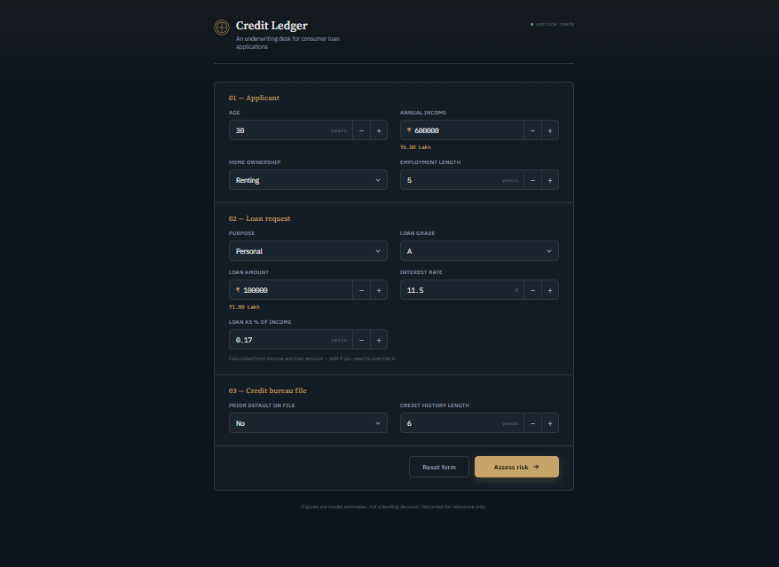
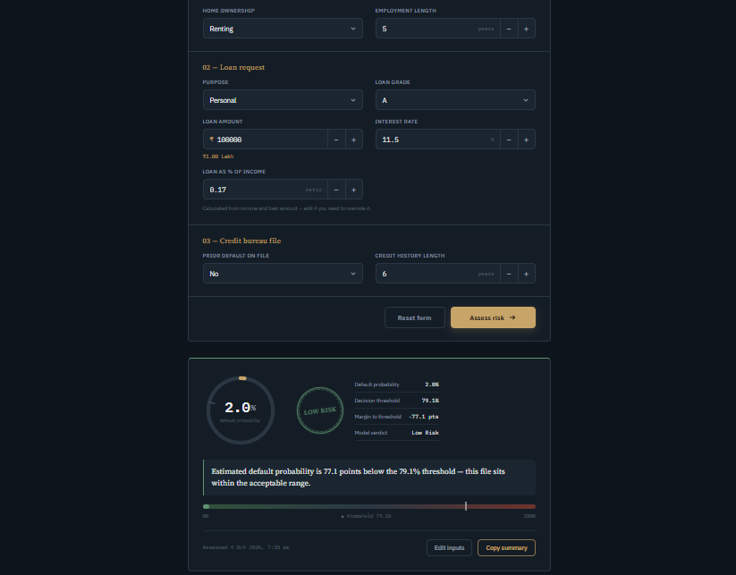

<div align="center">


# Quadra

### Credit Ledger — Loan Risk Assessment

_An underwriting desk for consumer loan applications._

<br />


</div>

---

**Quadra's Credit Ledger** takes an applicant's profile, loan request and credit bureau details, and returns the **probability that the applicant will default**, along with a clear **high / low risk verdict**.

The backend (API) and the frontend (UI) are served from the **same server**, so a single command is enough to run the whole app locally.

---

## Screenshots

### Landing view

The form the user sees when they open the website.



### Prediction result

The result panel shown after the user clicks **Assess risk**.



---

## Features

- **Default probability prediction** for a loan application, shown on an animated gauge.
- **High / Low risk verdict** with a stamp badge, a plain-language summary and a threshold meter.
- **Margin to threshold**: how many points the probability sits above or below the decision threshold.
- **Auto-calculated loan-to-income ratio** (can be manually overridden).
- **Interactive form**: number steppers, custom keyboard-friendly dropdowns, amount shown in Lakh / Crore, and inline validation.
- **Copy summary** button to copy the assessment result.
- **Live service status** indicator in the header.
- Responsive layout that works on desktop and mobile.

---

## Machine Learning Highlights

## Model Evaluation & Explainability

### 1. Confusion Matrix (Best Model)

Performance of the best model on the test set, using the optimized decision threshold.

<p align="center">
  
</p>

### Threshold Optimization

Instead of relying on the default `0.5` cut-off, the decision threshold is **optimized** for this problem. Credit-default data is typically imbalanced, so a tuned threshold gives a better balance between catching risky applicants and not rejecting good ones. The tuned value is returned by the API and displayed in the UI as the _Decision threshold_.

### Probability Calibration

Raw model scores are not always true probabilities. **Probability calibration** is applied so that the predicted default probability reflects the real likelihood of default (for example, applicants scored at ~30% actually default about 30% of the time). This makes the percentage shown in the UI meaningful and keeps the optimized threshold reliable.

### Explainability with SHAP

The project uses the **[SHAP](https://github.com/shap/shap)** library to understand the model's behaviour. With SHAP we analyze:

- **How much** each feature contributes to a prediction.
- **In which direction** it contributes: a _positive_ contribution pushes the applicant towards default, a _negative_ contribution pushes towards non-default.

This lets us verify that the model relies on sensible signals (such as loan grade, interest rate or loan-to-income ratio) and makes its decisions transparent rather than a black box.

---

## Input Features

| Field                        | Description                      | Valid values                                                                          |
| ---------------------------- | -------------------------------- | ------------------------------------------------------------------------------------- |
| `person_age`                 | Applicant's age                  | 18 – 100 years                                                                        |
| `person_income`              | Annual income (₹)                | ≥ 0                                                                                   |
| `person_home_ownership`      | Home ownership status            | `RENT`, `MORTGAGE`, `OWN`, `OTHER`                                                    |
| `person_emp_length`          | Employment length                | 0 – 60 years                                                                          |
| `loan_intent`                | Purpose of the loan              | `PERSONAL`, `EDUCATION`, `MEDICAL`, `VENTURE`, `HOMEIMPROVEMENT`, `DEBTCONSOLIDATION` |
| `loan_grade`                 | Loan grade                       | `A` – `G`                                                                             |
| `loan_amnt`                  | Requested loan amount (₹)        | ≥ 0                                                                                   |
| `loan_int_rate`              | Interest rate                    | 0 – 40 %                                                                              |
| `loan_percent_income`        | Loan amount as a ratio of income | 0 – 1 (auto-calculated)                                                               |
| `cb_person_default_on_file`  | Prior default on credit file     | `Y`, `N`                                                                              |
| `cb_person_cred_hist_length` | Credit history length            | 0 – 60 years                                                                          |

---

## Tech Stack

- **Backend:** Python, FastAPI, Uvicorn
- **Frontend:** HTML, CSS, vanilla JavaScript (served as static files)
- **ML:** Threshold optimization, probability calibration, SHAP for explainability

---

## Project Structure

```
.
├── main.py              # FastAPI app (API + static file serving)
├── requirements.txt     # Python dependencies
├── static/
│   ├── index.html       # UI markup
│   ├── style.css        # Styling
│   └── script.js        # Form logic, API calls, result rendering
└── assets/
    ├── icon/
    │   └── icon.svg     # Quadra brand logo
    └── ui/
        ├── 1.png        # Landing view screenshot
        └── 2.png        # Prediction result screenshot
```

> Your repository may contain additional files (trained model, notebooks, etc.). Adjust this tree as needed.

---

## Getting Started

### Prerequisites

- Python 3.9 or higher
- `pip` and `git`

### 1. Clone the repository

```bash
git clone https://github.com/amirsohail100/Credit_Risk_Assesment_Using_SHAP.git
cd Credit_Risk_Assesment_Using_SHAP
```

### 2. (Recommended) Create a virtual environment

```bash
python -m venv venv

# Linux / macOS
source venv/bin/activate

# Windows
venv\Scripts\activate
```

### 3. Install dependencies

```bash
pip install -r requirements.txt
```

### 4. Run the app

```bash
uvicorn main:app --reload
```

The app is now running at **http://127.0.0.1:8000**. Open it in your browser to use the UI.

Since this is a FastAPI app, interactive API docs are also available at **http://127.0.0.1:8000/docs**.

---

## API Reference

### `POST /predict`

Returns the default probability and risk verdict for one loan application.

**Request body**

```json
{
  "person_age": 30,
  "person_income": 600000,
  "person_home_ownership": "RENT",
  "person_emp_length": 5,
  "loan_intent": "PERSONAL",
  "loan_grade": "B",
  "loan_amnt": 100000,
  "loan_int_rate": 11.5,
  "loan_percent_income": 0.17,
  "cb_person_default_on_file": "N",
  "cb_person_cred_hist_length": 6
}
```

**Response fields**

| Field                 | Description                               |
| --------------------- | ----------------------------------------- |
| `default_probability` | Calibrated probability of default (0 – 1) |
| `threshold`           | Optimized decision threshold (0 – 1)      |
| `default_prediction`  | `1` = high risk, `0` = low risk           |
| `Result`              | Human-readable verdict                    |

**Example with cURL**

```bash
curl -X POST http://127.0.0.1:8000/predict \
  -H "Content-Type: application/json" \
  -d '{"person_age":30,"person_income":600000,"person_home_ownership":"RENT","person_emp_length":5,"loan_intent":"PERSONAL","loan_grade":"B","loan_amnt":100000,"loan_int_rate":11.5,"loan_percent_income":0.17,"cb_person_default_on_file":"N","cb_person_cred_hist_length":6}'
```

### `GET /openapi.json`

OpenAPI schema. The UI also uses it as a health check for the _service status_ indicator.

---

## Disclaimer

Figures are model estimates, not a lending decision. This project is for educational and reference purposes only.
